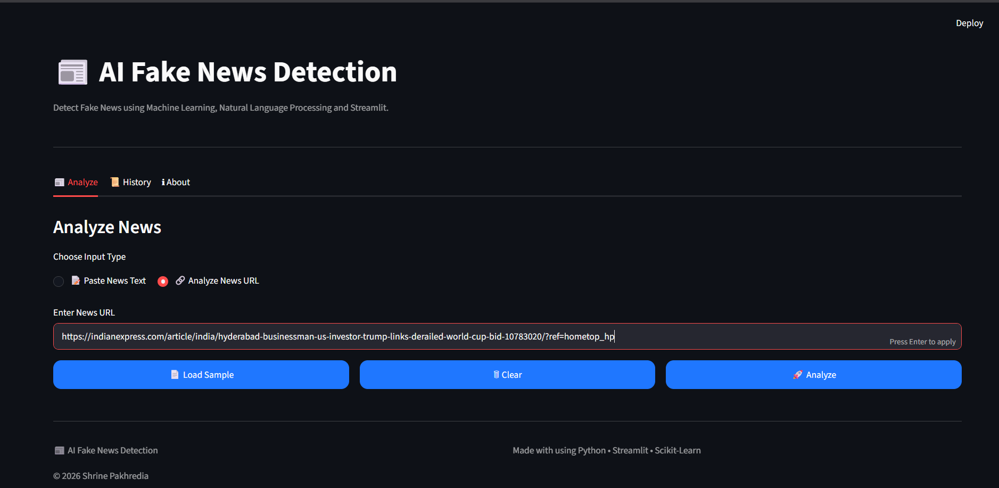
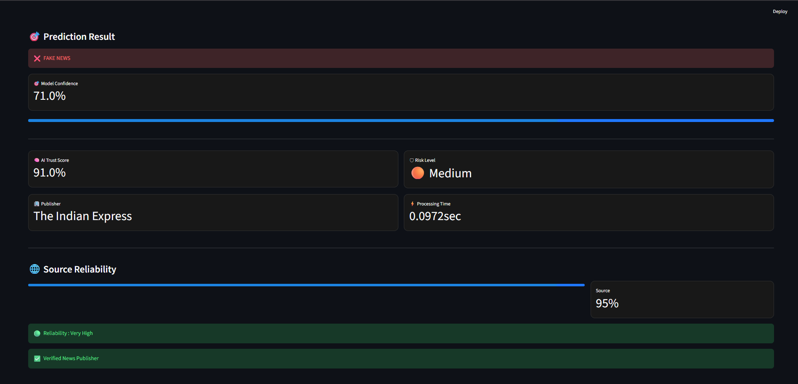
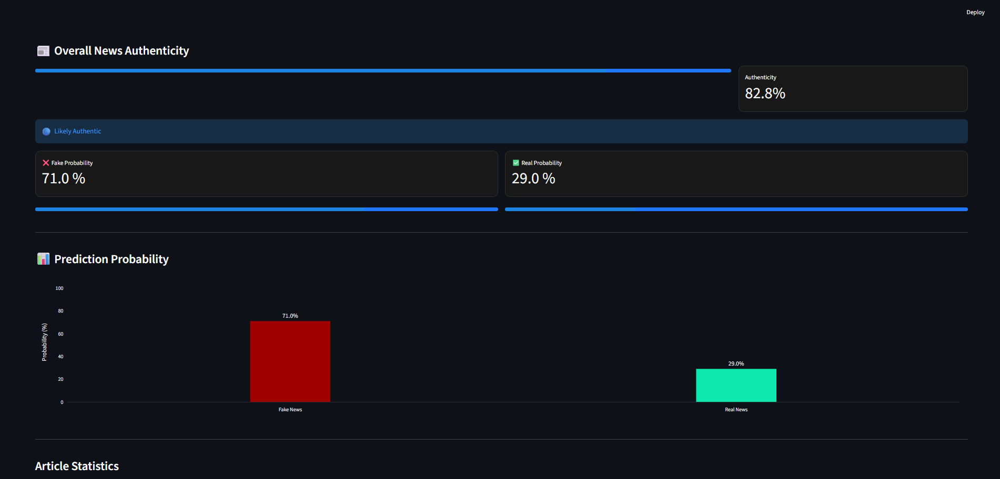
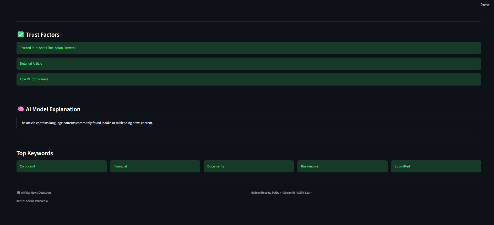
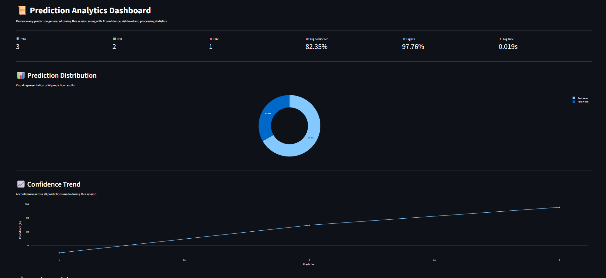

<div align="center">

# 📰 AI Fake News Detection

### AI-Powered Fake News Detection using NLP, Machine Learning & Source Reliability Analysis

[](https://www.python.org/)
[](https://streamlit.io/)
[](https://scikit-learn.org/)
[]()
[]()
[]()
[]()

> Detect fake news using Machine Learning, verify trusted publishers, analyze article authenticity, and generate AI-powered trust insights.

---

### 🌐 Live Demo(https://aifakenewsdetection-qxe5yc6znszq3ljuwtxfxk.streamlit.app/)

**GitHub Repository:**
https://github.com/shrinepakhredia-ui/AI_Fake_News_Detection_Pro

</div>

---

# 📖 Overview

AI Fake News Detection Pro is an AI-powered web application that detects whether a news article is **Real** or **Fake** using Natural Language Processing and Machine Learning.

The application goes beyond simple text classification by combining:

- Machine Learning Prediction
- Trusted Publisher Verification
- Source Reliability Analysis
- AI Explanation
- Authenticity Score
- Prediction Analytics Dashboard

to provide transparent, explainable and user-friendly fake news detection.

---

# ✨ Key Features

## 🤖 AI Fake News Detection

- Predicts whether a news article is **Real** or **Fake**
- Random Forest Classifier
- TF-IDF Feature Extraction
- Real-time prediction

---

## 🌐 URL-Based News Analysis

Paste a news URL and the system automatically:

- Extracts article content
- Reads title
- Downloads article
- Cleans text
- Predicts authenticity

---

## 🏢 Trusted Publisher Verification

Detects trusted publishers including:

- Reuters
- BBC
- The Hindu
- The Indian Express
- Hindustan Times
- NDTV
- Times of India
- AP News
- Financial Express
- MoneyControl
- Business Standard
- Livemint

---

## 📊 Source Reliability Score

Every supported publisher is assigned a credibility score.

Example:

| Publisher      | Reliability |
| -------------- | ----------- |
| Reuters        | 99%         |
| BBC            | 99%         |
| The Hindu      | 97%         |
| Indian Express | 95%         |

---

## 🧠 AI Trust Score

Trust Score is calculated using multiple factors:

- ML Confidence
- Trusted Publisher
- Source Reliability
- Article Length
- AI Confidence

---

## ✅ Overall News Authenticity

The final authenticity score combines:

- Model Confidence
- AI Trust Score
- Source Reliability

to provide a single authenticity percentage.

---

## 💡 AI Explanation Panel

Explains why the model predicted the article as Real or Fake.

Example:

✔ Trusted Publisher

✔ High ML Confidence

✔ Detailed Article

✔ Reliable Source

---

## 📈 Interactive Dashboard

The Streamlit dashboard includes:

- Confidence Meter
- Trust Score
- Source Reliability
- Authenticity Score
- Processing Time
- AI Explanation
- Top Keywords
- Prediction History

---

## 📥 Prediction History

- Stores previous predictions
- Download CSV
- View historical analysis

---

## 📂 Sample News Loader

- Load Random Real News
- Load Random Fake News
- Test the model instantly using benchmark datasets

---

## 📊 Prediction Analytics Dashboard

- Total Predictions
- Real vs Fake Statistics
- Average Confidence
- Highest Confidence
- Processing Time
- Download Prediction History

---

## ⚠ AI Disclaimer

- Clearly communicates model limitations
- Encourages verification through trusted sources
- Prevents misuse of AI predictions

# 🧠 Machine Learning Workflow

```text
News Article / URL
        │
        ▼
Text Cleaning
        │
        ▼
TF-IDF Feature Extraction
        │
        ▼
Logistic Regression
        │
        ▼
Prediction
        │
        ▼
Publisher Verification
        │
        ▼
Reliability Analysis
        │
        ▼
AI Explanation
        │
        ▼
Authenticity Score
        │
        ▼
Prediction Dashboard
```

---

# 🛠 Tech Stack

| Category            | Technologies        |
| ------------------- | ------------------- |
| Programming         | Python              |
| Web Framework       | Streamlit           |
| Machine Learning    | Scikit-Learn        |
| NLP                 | TF-IDF              |
| Model               | Logistic Regression |
| Data Processing     | Pandas, NumPy       |
| Visualization       | Plotly              |
| Model Serialization | Joblib              |
| URL Extraction      | Newspaper3k         |
| HTML Parsing        | BeautifulSoup4      |
| Data Source         | ISOT + WELFake      |

---

# 📊 Model Performance

| Metric    | Score      |
| --------- | ---------- |
| Accuracy  | **94.34%** |
| Precision | **94%**    |
| Recall    | **94%**    |
| F1 Score  | **94%**    |

---

# 📸 Screenshots

## 🏠 Home Page

<p align="center">

</p>

## 📰 Prediction Result

<p align="center">


---

## 🌐 URL Analysis

<p align="center">

</p>

## 📊 Prediction Dashboard

<p align="center">


## 🧠 AI Explanation

<p align="center">


## 📜 Prediction History

<p align="center">

</p>

# 📂 Project Structure

```text
AI_Fake_News_Detection_Pro
│
├── app.py
├── config.py
├── predict.py
├── requirements.txt
│
├── models
│   ├── random_forest.pkl
│   ├──logistic_regression.pkl
│   └── tfidf_vectorizer.pkl
│
├── src
│   ├── preprocessing.py
│   ├── trainer.py
│   ├── feature_engineering.py
│   ├── ui.py
│   ├── source_checker.py
│   ├── source_score.py
│   └── url_extractor.py
│
└── README.md
```

---

# ⚙ Installation

### Clone Repository

```bash
git clone https://github.com/shrinepakhredia-ui/AI_Fake_News_Detection_Pro.git
```

### Go to Project Folder

```bash
cd AI_Fake_News_Detection_Pro
```

### Install Dependencies

```bash
pip install -r requirements.txt
```

### Run the Application

```bash
streamlit run app.py
```

---

# 🚀 Future Improvements

- Live News API Integration
- BERT / RoBERTa based Classification
- Explainable AI (SHAP/LIME)
- Browser Extension
- Multilingual Fake News Detection
- Image & Video Fake News Detection
- LLM-assisted Fact Verification

---

# ⚠ Model Limitations

Although the model performs well on benchmark datasets, predictions on unseen or rapidly evolving news events may vary.

Current limitations include:

- Trained primarily on ISOT and WELFake datasets.
- Performance may decrease on regional or emerging news topics.
- Predictions are probabilistic rather than absolute.
- Results should always be verified using trusted news organizations.

This project is intended for educational, research and portfolio purposes.

---

# 👨‍💻 Author

**Shrine Pakhredia**

B.Tech Artificial Intelligence & Machine Learning

GitHub: https://github.com/shrinepakhredia-ui

---

<div align="center">

### ⭐ If you found this project useful, don't forget to Star the repository!

</div>
